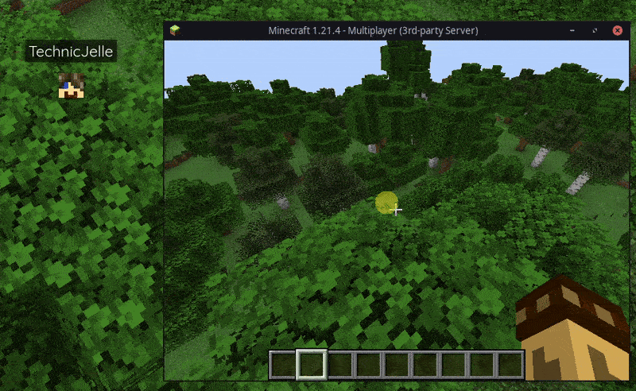

# BlueMap Player Control

Simple [Paper](https://papermc.io/) plugin that allows you to show/hide players on [BlueMap](https://github.com/BlueMap-Minecraft/BlueMap/)

## Commands
| Command               | Usage                                | Permission                |
|-----------------------|--------------------------------------|---------------------------|
| `/bmpc`               | Toggles your own visibility          | `bmpc.self.toggle`        |
| `/bmpc show`          | Makes yourself visible               | `bmpc.self.show`          |
| `/bmpc hide`          | Makes yourself invisible             | `bmpc.self.hide`          |
| `/bmpc [player]`      | Toggles the visibility of any player | `bmpc.others.toggle` (OP) |
| `/bmpc show [player]` | Makes the specified player visible   | `bmpc.others.show` (OP)   |
| `/bmpc hide [player]` | Makes the specified player invisible | `bmpc.others.hide` (OP)   |

ℹ️️ Supports `@a`, `@p`, `@r` and `@s` as player arguments.

## [Click here to download!](../../releases/latest)

## Support
To get support with this plugin, join the [BlueMap Discord server](https://bluecolo.red/map-discord) and ask your questions in [#3rd-party-support](https://discord.com/channels/665868367416131594/863844716047106068). You're welcome to ping me, @TechnicJelle.
